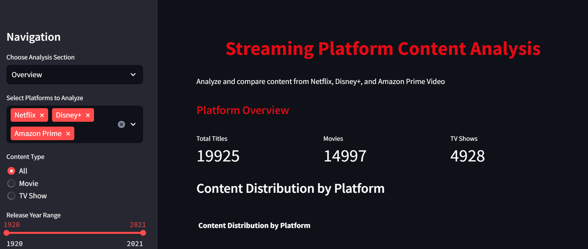
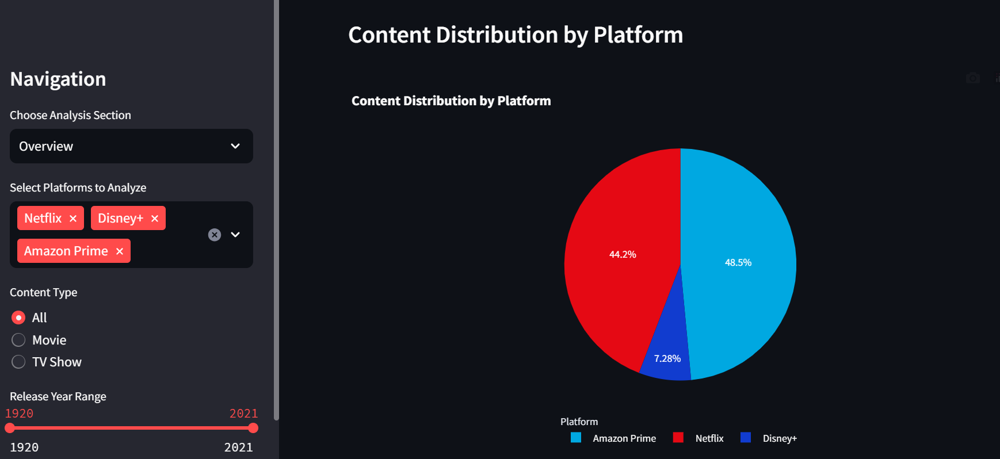
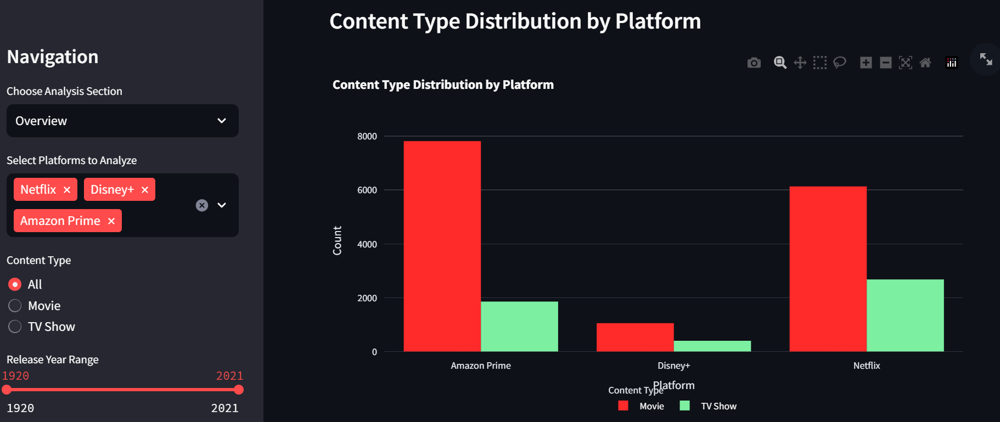
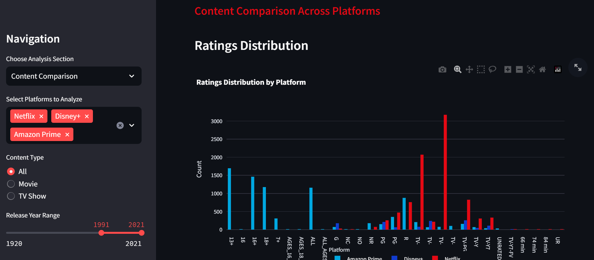
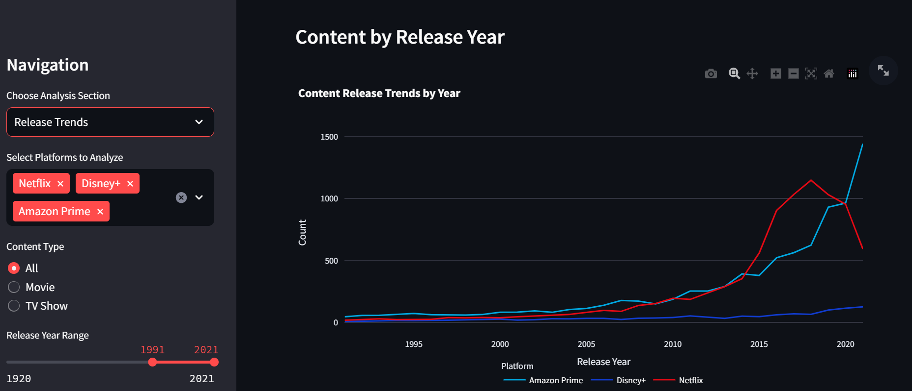
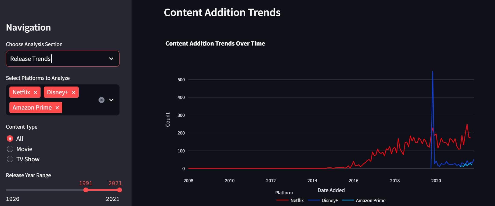
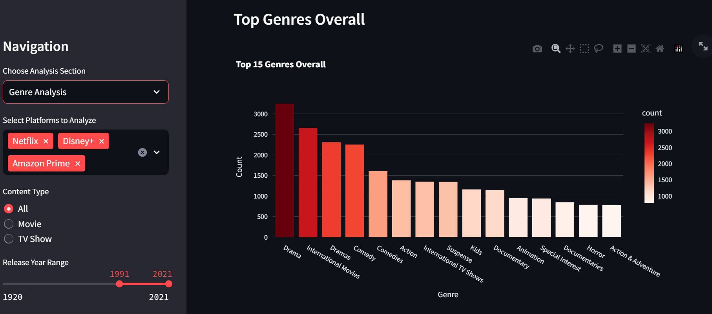
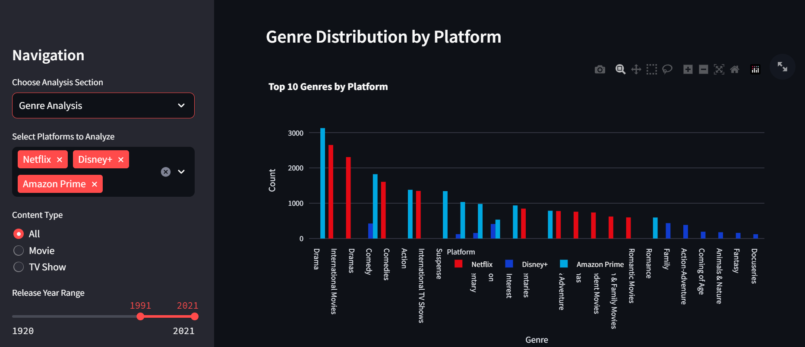
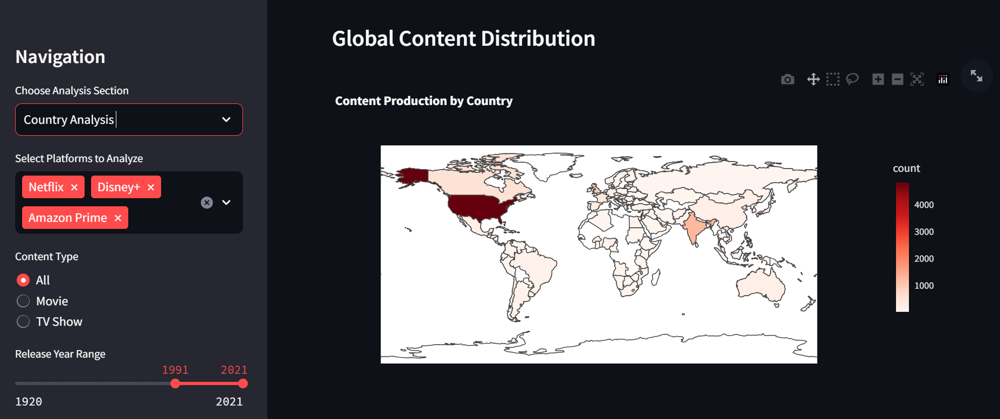

# Movies & Shows Analysis Dashboard

## Overview

This interactive dashboard provides comprehensive analysis and visualization of content from major streaming platforms - Netflix, Disney+, and Amazon Prime. It allows users to explore trends, compare content libraries, analyze genres, and get personalized recommendations.

## Features

- **Platform Overview**: View summary statistics and content distribution across platforms
- **Content Comparison**: Compare ratings, duration, and other metrics between platforms
- **Release Trends**: Analyze content release patterns over time
- **Genre Analysis**: Explore popular genres and their distribution across platforms
- **Country Analysis**: Visualize content production by country with interactive maps
- **Content Recommendation**: Get personalized recommendations based on your interests

## Data Sources

This project uses datasets from:
- Netflix movie and TV show catalog
- Disney+ movie and TV show catalog
- Amazon Prime Video movie and TV show catalog

Each dataset contains information about titles, types, release years, genres, cast, directors, and more.

# StreamPy: OTT Platform Analyzer 🎬



## 📊 Overview

StreamPy is a comprehensive data visualization and analytics platform for comparing content across major streaming services including Netflix, Disney+, and Amazon Prime. The application provides deep insights into content catalogs, helping users understand the distribution, trends, and patterns across different streaming platforms.

## ✨ Features

- **Platform Overview**: Compare content libraries across Netflix, Disney+, and Amazon Prime
- **Content Comparison**: Analyze distribution of movies vs TV shows across platforms
- **Genre Exploration**: Discover popular genres and their distribution
- **Country-wise Analysis**: Explore content from different countries with interactive maps
- **Release Trends**: Visualize content releases over time
- **Content Recommendation**: Get personalized content recommendations based on your preferences

## 📸 Screenshots

### Platform Overview

*Content distribution across major streaming platforms*

### Content Analysis

*Distribution of Movies vs TV Shows across platforms*

### Ratings Comparison

*Distribution of content ratings across platforms*

### Release Trends

*Content release trends over the years*

### Content Addition Trends

*Content addition trends over time*

### Genre Analysis

*Top genres across all platforms*


*Genre distribution by platform*

### Global Content Distribution

*Geographic distribution of content origins*

## 🛠️ Technology Stack

- **Python**: Core programming language
- **Streamlit**: Web application framework for data visualization
- **Pandas**: Data manipulation and analysis
- **Plotly**: Interactive visualization library
- **Scikit-learn**: Machine learning for recommendation systems
- **TF-IDF Vectorizer**: Content-based filtering for recommendations
- **Cosine Similarity**: Measuring content similarity for recommendations

## 🚀 Installation & Usage

1. Clone the repository:
   ```bash
   git clone https://github.com/JALAJ-PATEL/StreamPy-OTT_Platform_Analyser_Netflix-Prime-Hotstar.git
   cd StreamPy-OTT_Platform_Analyser_Netflix-Prime-Hotstar/Movies-Shows-Analysis
   ```

2. Create and activate a virtual environment (recommended):
   ```bash
   python -m venv venv
   # On Windows
   venv\Scripts\activate
   # On macOS/Linux
   source venv/bin/activate
   ```

3. Install dependencies:
   ```bash
   pip install -r requirements.txt
   ```

4. Prepare the data:
   - Create a `data` directory
   - Place the following CSV files in the data directory:
     - `netflix_titles.csv`
     - `disney_plus_titles.csv`
     - `amazon_prime_titles.csv`

5. Run the application:
   ```bash
   streamlit run app.py
   ```

6. Open your browser and go to `http://localhost:8501`

## 📊 Data Structure

The application expects CSV files with the following structure:
- `title`: The title of the movie or TV show
- `type`: Movie or TV Show
- `release_year`: Year of release
- `rating`: Content rating (e.g., PG-13, TV-MA)
- `duration`: Length of the content (minutes for movies, seasons for TV shows)
- `listed_in`: Genres
- `description`: Plot summary
- `director`: Director(s)
- `cast`: Main cast
- `country`: Country of production
- `date_added`: Date added to the platform
- `platform`: The streaming platform (Netflix, Disney+, Amazon Prime)

## 📁 Project Structure

```
Movies-Shows-Analysis/
├── app.py                  # Main Streamlit application
├── utils/                  # Utility modules
│   ├── data_loader.py      # Data loading and processing
│   ├── preprocessing.py    # Data preprocessing functions
│   ├── recommendation.py   # Recommendation system
│   └── visualization.py    # Visualization functions
├── data/                   # Dataset directory
│   ├── netflix_titles.csv  # Netflix dataset
│   ├── disney_plus_titles.csv  # Disney+ dataset
│   └── amazon_prime_titles.csv  # Amazon Prime dataset
├── screenshots/            # Application screenshots
├── requirements.txt        # Required Python packages
└── README.md               # Project documentation
```

## 🧠 Technical Highlights

### Recommendation System
- **Content-Based Filtering**: Uses TF-IDF vectorization to create content profiles
- **Hybrid Recommendations**: Combines content and genre-based approaches for better results
- **Customizable Weights**: Adjust the importance of different factors in recommendations

### Data Preprocessing
- Handles missing values and inconsistent data formats
- Standardizes ratings across platforms
- Cleans and formats text data for analysis
- Extracts useful date information for trend analysis

### Visualization
- Interactive charts and graphs using Plotly
- Geographic visualizations with choropleth maps
- Custom color schemes for different platforms

## 👨‍💻 Author

- **Jalaj Patel** - [GitHub](https://github.com/JALAJ-PATEL)